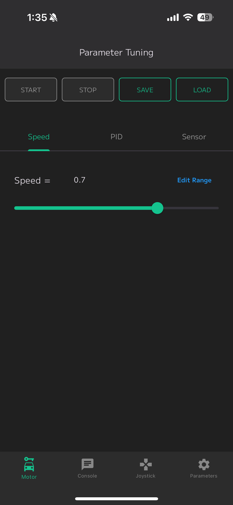
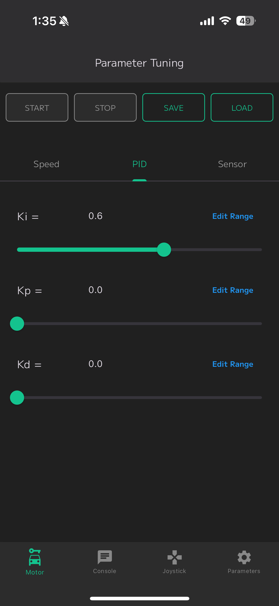
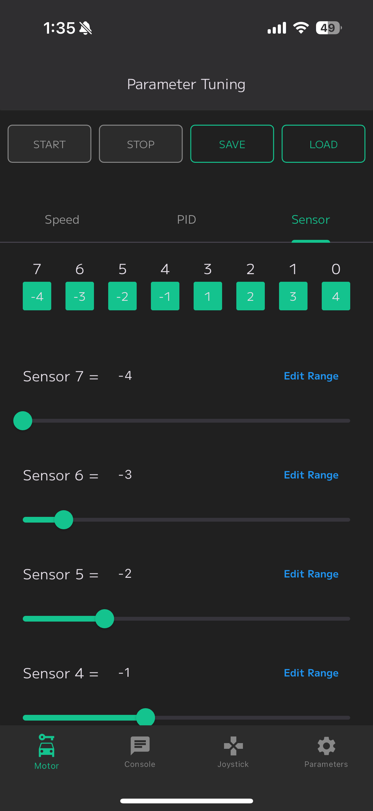
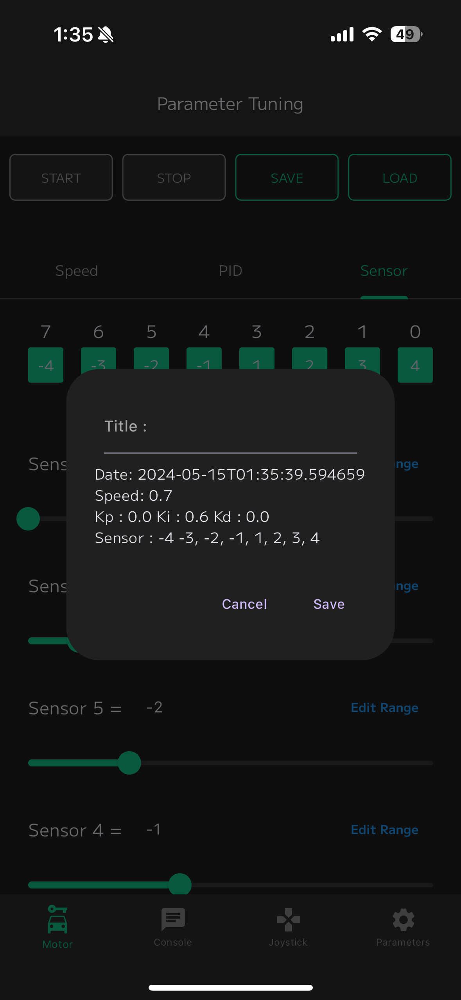
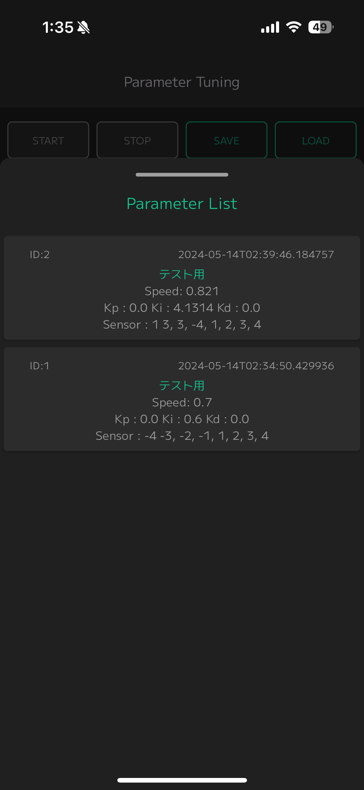
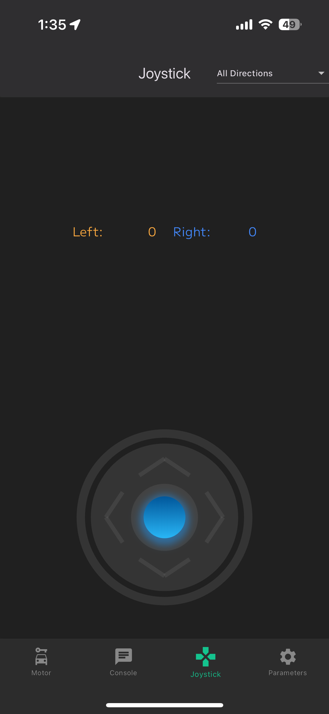
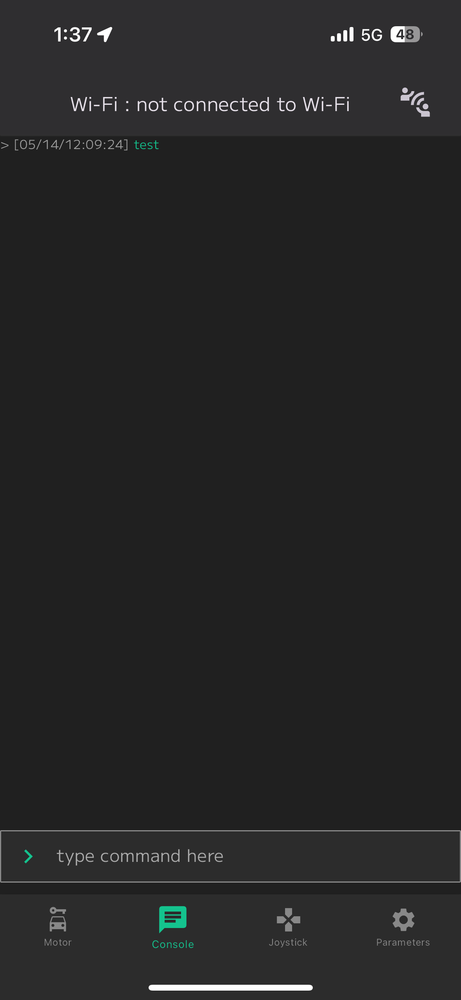

## Line Following Robot Control App
This app is a smartphone application for remotely controlling a line-following robot. Users can use the app to adjust speed, PID control parameters, and sensor values. The main features are as follows:

### Main Features
Speed Adjustment: Set the robot's speed using a slider.

PID Parameter Adjustment: Adjust each PID control parameter (Kp, Ki, Kd) in real-time.

Sensor Value Adjustment: Check and adjust the values of each sensor.

Parameter Save/Load: Save the adjusted parameters and load them later.

Joystick Operation: Manually control the robot using a joystick.

Console: Check and send logs or commands.

### How to Use
Launch the app.
Connect to the robot.
Adjust speed, PID parameters, and sensor values as needed.
Save parameters for easy retrieval the next time you use the app.
Use the joystick to manually control the robot.
Check and send logs or commands in the console.